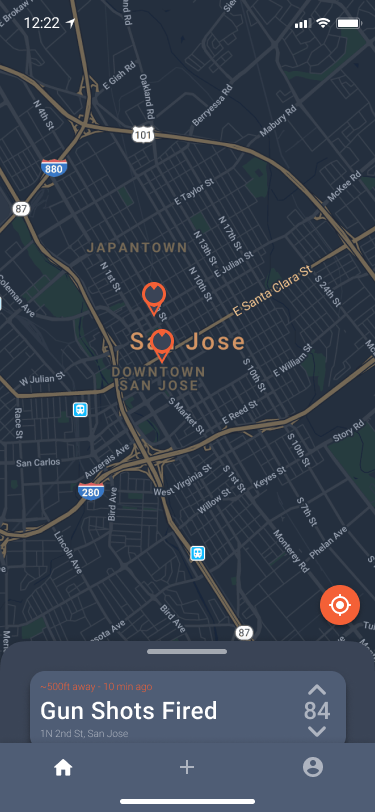
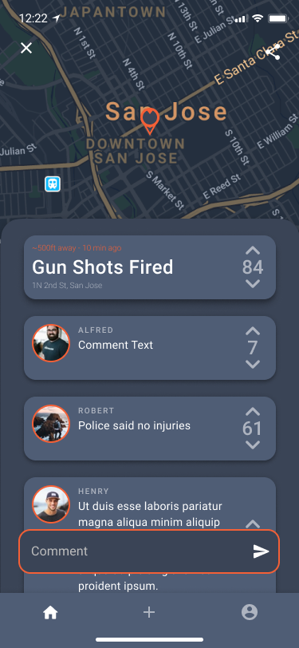

# S.A.F.E
Excerpt of the original project done as a freelance project.

S.A.F.E lets you share and recieve alerts about your surrounding area related to safety issues.
View events on a map or in a list.

## Images



## Implementation
The application is using firebase as a backend, bloc pattern as its state management and the original repository implemented git flow:
```
*   e46bd51 Beta 0.1.1
|\ 
| |  
| *   5359830 Merge branch 'branch-HotFix-Animation' into development
| |\  
| | * 9afab00 SpeedUp Animation & event dependent
| |/  
| *   8a86b0e Merge branch 'HotFix' into development
| |\  
| | * 0108b4b Updated .gitignore
| | * be76db5 Updated Padding and Icon
| * |   1fb44c9 Merge branch 'feature-android-release-support' into development
| |\ \  
| | * | 08009dc Update File Structure
| | * | 96a9dd7 Initial File Changes
| | |/  
| | * 14bcde0 Updated Version
| | * a74f555 Bugfixes & new Icon
| | * eba0efb Multiple Bugfixes
| | * 3d663cc Updated IOS Files
| |/  
| *   13d93c3 Merge branch 'feature-profile' into development
| |\  
| | * 7f47456 initial files
| * | 86c1e5d BugFix FabTap
| * |   d4dbf76 Merge branch 'feature-Comment' into development
| |\ \  
| | * | bebcbab Comment support
| | * | aae4937 Comment Initial Files
| * | |   f361012 Merge branch 'feature-Map-LocationFab' into development
| |\ \ \  
| | |/ /  
| |/| |   
| | * | 29971f6 Remove import
| | * |   56be132 Merge branch 'development' into feature-Map-LocationFab
| | |\ \  
| | |/ /  
| |/| |   
| * | |   4748cc4 Merge branch 'feature-Live-Update' into development
| |\ \ \  
| | * | | 5edfe73 Live Update
| |/ / /  
| | * | dd376cf Initial files
| |/ /  
| * |   aef323c Merge branch 'feature-add-new' into development
| |\ \  
| | * | 8be2785 Add Event Fixes
| | * | fdca989 Create New Logic
| | |/  
| * |   a92ff92 Merge branch 'feature-ios-support' into development
| |\ \  
| | |/  
| |/|   
| | * caf2667 Update Display Name
| | * 688c6b7 embedded view support
| | * f863e70 initial files
| |/  
| * a8446d9 Initial File Structure
|/  
* 80864ef Initial Project Commit
* e8c3825 Initial commit
```